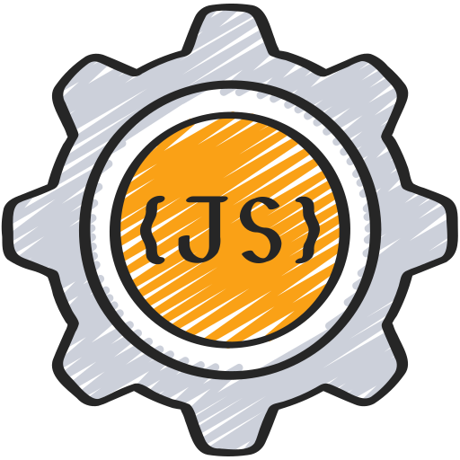

  

  <em>Olá, eu sou</em> **[Marco Scotti](https://seu-portfolio.com)** , <em>estudante de </em>**Engenharia de Software**<em> e apaixonado por desenvolvimento e tecnologia. Sou Servidor público federal e tenho a programação como </em>**Hobby**, <em>Estou em busca de aprender novas tecnologias, melhorar minhas habilidades em programação e colaborar em projetos desafiadores</em>. 
   

  <samp>  
    <a href="https://github.com/MarcoScottiGitHub?tab=followers">Follow!</a>
  </samp>

  
 
    <b> click and visit!
! </b> <i>(click to expand!)</i> 
  

  

  
  
