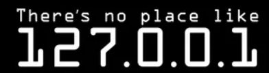

  

 <em>Download do PDF</em> :     **[BLACK HAT PYTHON - 2ª EDIÇÃO
](assets/blackhatpython.pdf)**  

   

  <samp>  
    <a href="https://github.com/MarcoScottiGitHub?tab=followers">Follow!</a>
  </samp>

  
 
    <b> click and visit!
! </b> <i>(click to expand!)</i> 
  

  

  
  
